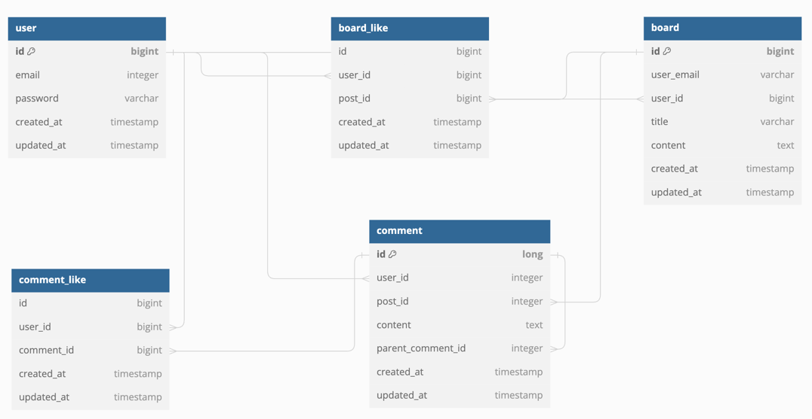

# [JPA] 게시판 'Java_Board'

## Entity 정의

JPA 엔티티 클래스는 반드시 기본 생성자(No-args constructor)를 가져야 합니다. 이는 JPA가 리플렉션을 통해 엔티티 객체를 생성할 때 기본 생성자를 사용하기
때문입니다. 하지만 이 기본 생성자는 public 또는 protected 접근 제어자를 가져야 합니다.

- `Setter` 는 사용하지 않습니다.
- 생성자를 통해 객체 생성 규칙을 정의합니다.

```java

@Entity
@Getter
@NoArgsConstructor(access = AccessLevel.PROTECTED)
public class User {
    @Id
    @GeneratedValue(strategy = GenerationType.IDENTITY)
    private Long id;

    @Column(unique = true, nullable = false)
    private String email;

    @Column(nullable = false)
    private String password;

    public User(String email, String password) {
        this.email = email;
        this.password = password;
    }
}
```

참조:

- https://docs.oracle.com/cd/E19798-01/821-1841/bnbqb/index.html
- https://docs.spring.io/spring-boot/docs/1.2.0.M1/reference/html/boot-features-sql.html

## 📌 ERD 구조



<br><b>user</b>: 유저 테이블
<br><b>board</b>: 게시글 테이블
<br><b>comment</b>: 게시글 댓글 테이블
<br><b>board_like</b>: 게시글 좋아요 테이블
<br><b>comment_like</b>: 댓글 좋아요 테이블

## 📌 Entity Relationship

<br><b> 🔗 user(1) : board(N)</b>
<br> 유저는 여러개의 글을 작성할 수 있고, 게시글은 유저 한 명만을 작성자로 가진다
<br> board 테이블의 fk: user_id

<br><b> 🔗 user(N) : board(N)</b>
<br> 유저는 여러개의 댓글을 작성할 수 있고, 게시글은 여러 유저의 댓글을 가질 수 있다
<br> comment 테이블을 중간 테이블로 가짐으로써, user와 board 테이블의 N:N 관계를 구현한다
<br> comment 테이블의 fk: user_id(from user), board_id(from board)

<br><b> 🔗 user(N) : board(N)</b>
<br> 유저는 여러개의 게시글에 좋아요를 누를 수 있으며, 한 게시글에 대한 좋아요는 여러 명의 유저를 포함한다
<br> borad_like 테이블을 중간 테이블로 가짐으로써, user와 board 테이블의 N:N 관계를 구현한다
<br> borad_like 테이블의 fk: user_id(from user), board_id(from board)

<br><b> 🔗 user(N) : comment(N)</b>
<br> 유저는 여러개의 댓글에 좋아요를 누를 수 있으며, 한 댓글에 대한 좋아요는 여러 명의 유저를 포함한다.
comment_like 테이블을 중간 테이블로 가짐으로써, user와 comment 테이블의 N:N 관계를 구현한다
<br> comment_like 테이블의 fk: user_id(from user), comment_id(from comment)

<br><b> 🔗 comment(1) : comment(N)</b>
<br> 대댓글일 경우, 하나의 부모 댓글(직속 상위 댓글)을 가진다. 대댓글의 깊이는 제한이 없다. 하나의 부모 댓글은 여러개의 대댓글을 가질 수 있다.
이는 comment 엔티티의 대댓글 데이터의 parent_comment_id가 부모 댓글 데이터의 id 필드를 자기 참조함으로써 구현한다.
<br> 대댓글이 아닌 경우, 부모 댓글을 참조할 필요 없으므로 parent_comment_id는 nullable하다.

## 📌 Relationship 관련 개념

### @OneToMany() 관련 속성 : '1'에 해당되는 엔티티 클래스에서 정의

### 1. mappedBy

맵핑된 반대편 엔티티(N에 해당하는 엔티티)에서 이 관계를 소유하고 있는 필드명을 입력
<br> ex. board 테이블에서 작성자 정보를 user 테이블로부터 참조할때, @ManyToOne()이 달린 필드명이 'user'라면,
user 테이블에서 mappedBy = "user"가 된다.<br>
(⚠️ mappedBy에는 "user_id"가 아닌, user가 들어간다는 것)

    @Entity 
    public class User { 
        @OneToMany(mappedBy = "user")
        private List<Board> boards;
    }
    
    @Entity
    public class Board {
        @ManyToOne(fetch = FetchType.LAZY)
            @JoinColumn(name = "user_id")
            private User user;

        @OneToMany(mappedBy = "board", orphanRemoval = true, cascade = CascadeType.REMOVE)
        private List<Comment> comments = new ArrayList<>();
    
        @OneToMany(mappedBy = "board", orphanRemoval = true, cascade = CascadeType.REMOVE)
        private List<BoardLike> boardLikes = new ArrayList<>();
    }

    @Entity
    public class Comment{
        @ManyToOne(fetch = FetchType.LAZY)
        @JoinColumn(name = "board_id", nullable = false)
        private Board board;
    
        @ManyToOne(fetch = FetchType.LAZY)
        @JoinColumn(name = "user_id", nullable = false)
        private User user;
    
        @ManyToOne(fetch = FetchType.LAZY)
        @JoinColumn(name = "parent_comment_id")
        private Comment parentComment;

        @OneToMany(mappedBy = "parentComment")
        private List<Comment> childCommentList;
    }

    @Entity
    public class BoardLike {

        @ManyToOne(fetch = FetchType.LAZY)
        @JoinColumn(name = "board_id", nullable = false)
        private Board board;

        @ManyToOne(fetch = FetchType.LAZY)
        @JoinColumn(name = "user_id", nullable = false)
        private User user;
    }

### 2. cascade

cascade 속성은 부모 엔티티의 상태 변화가 자식 엔티티에 어떻게 전파되는지를 정의
<br> 부모 엔티티에서 수행된 작업(예: 저장, 삭제 등)이 자식 엔티티에도 적용되도록 설정

<br><b>ALL</b>: 모든 작업을 전파
<br><b>PERSIST</b>: 부모 엔티티가 저장될 때 자식 엔티티도 저장
<br> 예시: 새로운 주문(Order)을 생성하면서 관련된 주문 항목(OrderItem)들도 함께 저장하고자 할 때.

<br><b>MERGE</b>: 부모 엔티티가 병합될 때 자식 엔티티도 병합
<br> 예시: 기존 주문을 수정하면서 주문 항목도 수정해야 할 때.

<br><b>REMOVE</b>: 부모 엔티티가 삭제될 때 자식 엔티티도 삭제
<br> 예시: 주문을 삭제할 때 관련된 주문 항목들도 함께 삭제하고자 할 때.

<br><b>REFRESH</b>: 부모 엔티티가 새로고침될 때 자식 엔티티도 새로고침
<br> 예시: 데이터베이스의 현재 상태로 엔티티를 동기화하고자 할 때, 부모와 자식 엔티티가 모두 갱신되어야 할 때.

<br><b>DETACH</b>: 부모 엔티티가 분리될 때 자식 엔티티도 분리
<br> 예시: 엔티티를 더 이상 영속성 컨텍스트에서 관리하지 않을 때 부모와 자식 엔티티 모두를 분리하고자 할 때.

'Java_Board'에서 설정한 cascade는 다음과 같다.

#### <br><b> 🔗 board(1) : comment(N)  - 게시글과 댓글 간의 cascade

CascadeType.Remove </b>

```   
    @OneToMany(mappedBy = "board", orphanRemoval = true, cascade = CascadeType.REMOVE)
    private List<Comment> comments = new ArrayList<>();
```

- PERSIST : 게시글 저장 시점과 각 댓글의 저장 시점이 다르기 때문에(게시글 저장 후, 댓글은 계속 추기적으로 생성되는 구조 )
  필요성을 못 느낌
- MERGE : 댓글 데이터와 게시글 데이터를 함께 업데이트 해야하기 보다는 게시글은 게시글대로, 댓글은 댓글대로 독립적으로 관리가 되므로
  크게 필요성 못 느낌(단, 2개의 엔티티간의 참조 관계만 잘 지켜지면 됨)
- REMOVE : 게시글이 삭제 될 때, 해당 게시글과 관련된 댓글들은 모두 삭제되어야 하므로 필요
- REFRESH, DETACH: 특정 엔티티를 영속성 컨텍스트에서(JPA에서 관리하는 범위) 분리하거나, 최신 상태의 엔티티로 자주 갱신해야할때(ex.구글 독스),
  동시성 문제를 해결해야할때 등에 필요하다고 함. 아직까지는 일반 게시판 로직에서 왜 필요한지 잘 모르겠음.
  <br>

#### <br><b> 🔗 board(1) : board_like(N)  - 게시글과 좋아요 간의 cascade

CascadeType.Remove </b>

```   
    @OneToMany(mappedBy = "board", orphanRemoval = true, cascade = CascadeType.REMOVE)
    private List<BoardLike> boardLikes = new ArrayList<>();
```

- PERSIST : 게시글 저장 시점과 좋아요 저장 시점은 독립적이므로 필요 없음.
- MERGE : 게시글은 게시글대로, 좋아요는 좋아요대로 독립적으로 관리가 되므로 필요성 못 느낌(단, 2개의 엔티티간의 참조 관계만 잘 지켜지면 됨)
- REMOVE : 게시글이 삭제 될 때, 해당 게시글과 관련된 좋아요 데이터는 모두 삭제되어야 하므로 필요
- REFRESH, DETACH: 특정 엔티티를 영속성 컨텍스트에서(JPA에서 관리하는 범위) 분리하거나, 최신 상태의 엔티티로 자주 갱신해야할때(ex.구글 독스),
  동시성 문제를 해결해야할때 등에 필요하다고 함. 아직까지는 일반 게시판 로직에서 왜 필요한지 잘 모르겠음.
  <br>

#### <br><b> 🔗 comment(N) : comment_like(N)  - 댓글과 댓글 좋아요 간의 cascade

CascadeType.Remove </b>

```   
    @OneToMany(mappedBy = "comment", cascade = CascadeType.REMOVE, orphanRemoval = true)
    private List<CommentLike> likeList;
```

- PERSIST : 댓글 저장 시점과 좋아요 저장 시점은 독립적이므로 PERSIST 필요 없음.
- MERGE : 댓글은 댓글대로, 좋아요는 좋아요대로 독립적으로 관리가 되므로 필요성 못 느낌(단, 2개의 엔티티간의 참조 관계만 잘 지켜지면 됨)
- REMOVE : 댓글 삭제 될 때, 해당 댓글과 관련된 좋아요 데이터는 모두 삭제되어야 하므로 필요
- REFRESH, DETACH: 특정 댓글을 영속성 컨텍스트에서(JPA에서 관리하는 범위) 분리하거나, 최신 상태의 엔티티로 자주 갱신해야할때(ex.구글 독스),
  동시성 문제를 해결해야할때 등에 필요하다고 함. 아직까지는 일반 게시판 로직에서 왜 필요한지 잘 모르겠음.
  <br>

#### <br><b> 🔗 comment(1) : comment(N)  - 상위 댓글과 대댓글간의 cascade

없음 </b>

```   
    @OneToMany(mappedBy = "parentComment")
    private List<Comment> childCommentList;
```

- PERSIST : 상위 댓글 생성 시점과 대댓글의 생성 시점이 다르기 때문에 필요 없음
- MERGE : 상위 댓글 데이터와 대댓글 데이터가 함께 업데이트 되어야하는 것은 아니므로 필요 없음.(단, 2개의 엔티티간의 참조 관계만 잘 지켜지면 됨)
- REMOVE : 상위 댓글이 삭제된다고 해서, 대댓글까지 삭제될 필요는 없음
- REFRESH, DETACH: 특정 엔티티를 영속성 컨텍스트에서(JPA에서 관리하는 범위) 분리하거나, 최신 상태의 엔티티로 자주 갱신해야할때(ex.구글 독스),
  동시성 문제를 해결해야할때 등에 필요하다고 함. 아직까지는 일반 게시판 로직에서 왜 필요한지 잘 모르겠음.
  <br>

참고로, 댓글 삭제의 경우는
<br> 1. 대댓글이 존재한다면 --> 댓글 데이터는 삭제하지 않으며, 내용만 '삭제된 댓글'임을 표시.(상태값 is_deleted=true)
<br> 2. 대댓글이 없다면 --> 댓글 데이터 자체 삭제

### 3. orphanRemoval

orphanRemoval 속성은 부모 엔티티에서 자식 엔티티가 제거되었을 때, 해당 자식 엔티티를 데이터베이스에서도 삭제할지를 정의한다.
이 속성이 true로 설정되면, 부모 엔티티와의 관계가 끊어진 자식 엔티티는 고아 객체로 간주되어 데이터베이스에서 삭제된다.

#### <br><b> 🧬 board(1) : comment(N)  - 게시글과 댓글 간의 cascade

orphanRemoval = true </b>

```   
    @OneToMany(mappedBy = "board", orphanRemoval = true, cascade = CascadeType.REMOVE)
    private List<Comment> comments = new ArrayList<>();
```

특정 게시글에 속하지 않은 댓글은 의미 없다. 따라서, 게시글과의 관계가 끊어진 댓글은 삭제한다.

#### <br><b> 🧬 board(1) : board_like(N)  - 게시글과 좋아요 간의 cascade

orphanRemoval = true </b>

```   
    @OneToMany(mappedBy = "board", orphanRemoval = true, cascade = CascadeType.REMOVE)
    private List<BoardLike> boardLikes = new ArrayList<>();
```

특정 게시글에 속하지 않은 좋아요는 의미 없다. 따라서, 게시글과의 관계가 끊어진 좋아요는 삭제한다.

#### <br><b> 🧬 comment(1) : comment_like(N)  - 댓글과 좋아요 간의 cascade

orphanRemoval = true </b>

```   
    @OneToMany(mappedBy = "comment", cascade = CascadeType.REMOVE, orphanRemoval = true)
    private List<CommentLike> likeList;
```

특정 댓글에 속하지 않은 좋아요는 의미 없다. 따라서, 댓글과의 관계가 끊어진 좋아요는 삭제한다.

#### <br><b> 🧬 comment(1) : comment(N)  - 상위 댓글과 대댓글간의 cascade

없음 </b>

```   
    @OneToMany(mappedBy = "parentComment")
    private List<Comment> childCommentList;
```

대댓글의 경우, 상위 댓글과의 관계가 끊어지더라도 남아있어야 한다고 생각했다.(상위 댓글이 삭제 되어도, 대댓글은 남아있는 경우가 있기 때문)
따라서, 상위 댓글과 대댓글은 독립적으로 다뤄질 필요가 있다고 생각해서, 우선 orphanRemoval=false로 하였다.

### @ManyToOne() 관련 속성 및 어노테이션

### 1. @JoinColumn

<br> 맵핑된 부모 엔티티의 pk값을 참조하고 있는 '본인 엔티티의 fk 컬럼명'이다.
<br> 기본적으로 @JoinColumn을 통해 생성된 필드는 nullable하다. 
<br> 따라서, not null 조건을 추가하고 싶으면 'nullable = false'를 따로 설정해야 한다. 

```
@Entity
public class User {
    @OneToMany(mappedBy = "user")
    private List<Board> boards;
}

@Entity
public class Board {
    @ManyToOne
    @JoinColumn(name = "user_id")
    private User user;
}
```

## 기타 궁금증

<br/> 왜 entitry에서는 long, repository에서는 Long을 써야 하는가?
